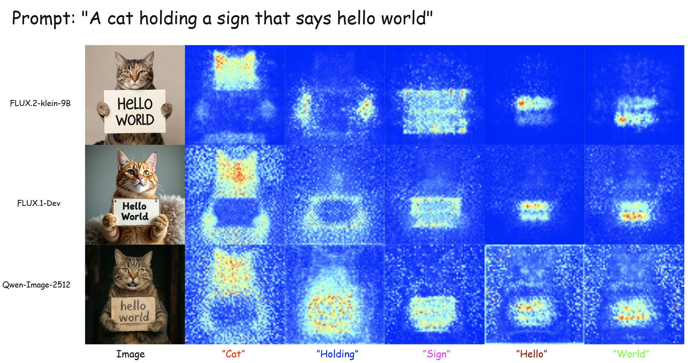

# Attline: Visualize Attention at a Line in Diffusers

> 捕获并可视化 diffusion pipeline 的 joint-attention 图 —— 可按 segment、按词或按 bounding box。轻量，无需 fork `diffusers`。

**语言：** [English](README.md) · 中文

由于 `diffusers>=0.35` 改写了 attention dispatch 接口，原有的 attention 可视化工具（基于旧的 attention-processor hook）在新的 transformer 上已经不再兼容。**Attline** 在新接口之上做了适配，并把整套逻辑封装成一行代码 —— `attach(pipe, words=[...])` —— 让你完全不用改动原有的 pipeline 调用方式，就能在任何受支持的 pipeline 上直接拿到按词的热力图，对代码的侵入降到最低。



## 当前支持的 pipeline

| Pipeline 类          | 模型                                                          | 示例                                                        |
| -------------------- | ------------------------------------------------------------ | ----------------------------------------------------------- |
| `Flux2KleinPipeline` | `black-forest-labs/FLUX.2-klein-9B`                          | [`examples/flux2_klein.py`](examples/flux2_klein.py)        |
| `FluxPipeline`       | `black-forest-labs/FLUX.1-dev`, `FLUX.1-schnell`             | [`examples/flux1_dev.py`](examples/flux1_dev.py)            |
| `QwenImagePipeline`  | `Qwen/Qwen-Image`, `Qwen/Qwen-Image-2512`                    | [`examples/qwen_image_2512.py`](examples/qwen_image_2512.py) |

## 安装

```bash
pip install -e .
# 或安装带 diffusers 版本锁的可选依赖：
pip install -e ".[diffusers]"
```

## 快速开始

一行代码即可启用注意力可视化：

```python
import torch
from diffusers import Flux2KleinPipeline
from attline import attach

pipe = Flux2KleinPipeline.from_pretrained(
    "black-forest-labs/FLUX.2-klein-9B", torch_dtype=torch.bfloat16
).to("cuda")

attach(pipe, words=["cat", "hello", "world"])

image = pipe(prompt="A cat holding a sign that says hello world").images[0]
image.save("out.png")
# 热力图已保存到 ./attn_out/
```

调用 `detach(pipe)` 可恢复原始 pipeline。

## 用法 —— `attach(pipe, ...)`

**最少必需参数：**

| 参数 | 说明 |
| --- | --- |
| `pipe` | 受支持的 diffusion pipeline 实例。 |
| `words=[...]` **或** `attention_pairs=[...]` | 至少指定一个需要保存热力图的目标。 |

**可选参数：**

| 参数 | 默认值 | 说明 |
| --- | --- | --- |
| `words` | `None` | prompt 中的词或短语列表，每个都会输出一张空间热力图及 overlay。 |
| `attention_pairs` | `None` | 底层 `(query_selector, key_selector)` 元组。 |
| `save_dir` | `"./attn_out"` | 热力图和 overlay 的输出目录（自动创建）。 |
| `heatmap_upscale` | `8` | 热力图 PNG 保存时的整数放大倍数，纯粹为了清晰度（不影响 capture 本身）。 |
| `fallback_to_sdpa` | `True` | 若捕获时 CUDA OOM，则回退到普通 SDPA 并计入 `skipped_capture_calls`。 |
| `capture_chunk_size` | `256` | 流式 softmax 的 query 分块大小。更小 → 显存更少、速度更慢。 |
| `pipeline_type` | `None` | 手动指定 adapter 名称；为 `None` 时自动根据 pipeline 类识别。 |

## 致谢

本项目受 [wooyeolbaek/attention-map-diffusers](https://github.com/wooyeolbaek/attention-map-diffusers) 启发，该项目开创了 diffusion pipeline 按 token 的 joint-attention 可视化方式。

## 引用

如果你觉得这个工具有帮助，欢迎在 GitHub 上点个 ⭐ 并引用：

```bibtex
@software{attline,
  title  = {attline: Lightweight joint-attention visualization for diffusion pipelines},
  year   = {2026},
  url    = {https://github.com/TeaWhiteBro/attline}
}
```

## 许可证

MIT。详见 [LICENSE](LICENSE)。
